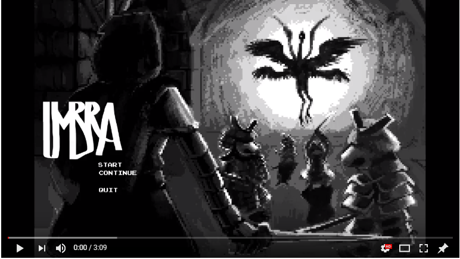
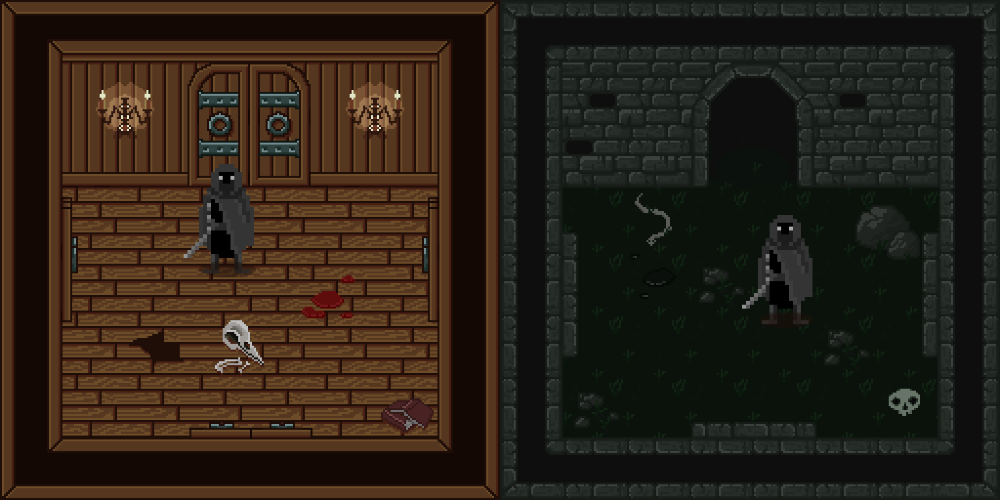
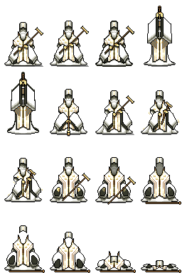

# Umbra
## This is a work in progress

Umbra is a pixelart-randomly-generated-dungeon-RPG game, made for the Game developement course at MFF UK 2017.

# Builds
[Windows](https://drive.google.com/file/d/1AVYMS5O40eXod_FSzDvq5qxsCiAqTkar/view?usp=sharing)   
[Mac](https://drive.google.com/open?id=1c1AVtX50DrE6XqbdSKfcXb4i7jW3eZhb)

# Team
Bolshikh Daria  
Buhai Alexandru  
Rybín Filip 

# Special thanks for the tutorials and music
TheHappieCat - https://www.youtube.com/user/TheHappieCat  
Brent Owens - https://github.com/sploreg/goap  
Matt Schell (Unity tutorial)  
Mattia Cupelli for the music  

# Video

# Images  
  
  
  
